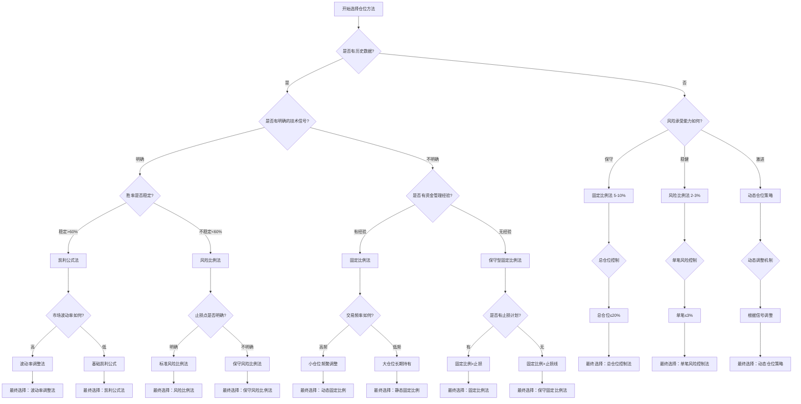

# 仓位计算方法选择指南

## 选择框架概述

仓位计算方法的选择是科学仓位管理的第一步。正确的方法选择能够更好地适应不同的市场环境、交易品种和投资者特征，从而提高风险管理效果和收益水平。

## 方法选择决策树

### 基础条件判断

```
开始 → 是否有历史数据？
         ├─ 是 → 去步骤2
         └─ 否 → 去步骤3
```

#### 步骤2：基于历史数据的策略选择
```
有历史数据 → 是否是趋势策略？
              ├─ 是 → 凯利公式法 + 波动率调整
              └─ 否 → 风险比例法 + 动态调整
```

#### 步骤3：无历史数据的策略选择
```
无历史数据 → 是否保守型投资者？
              ├─ 是 → 固定比例法(5-10%) + 严格止损
              └─ 否 → 风险比例法(2-3%) + 技术分析辅助
```

### 完整决策流程图



## 具体选择标准详解

### 1. 基于交易品种特性的选择

| 品种类型 | 波动特征 | 流动性 | 趋势性 | 推荐方法 | 理由 |
|---------|---------|---------|---------|---------|------|
| 蓝筹股 | 低-中 | 高 | 中-强 | 风险比例法 + 凯利公式 | 趋势明确，适合分批建仓 |
| 成长股 | 高 | 中-高 | 强 | 动态仓位策略 + 波动率调整 | 波动大，需要灵活调整 |
| 价值股 | 低 | 高 | 弱-中 | 固定比例法 | 稳定性优先 |
| ETF指数 | 中 | 高 | 中 | 风险比例法 | 透明度高，风险可控 |
| 期货 | 极高 | 高 | 强 | 波动率调整法 + 止损 | 高杠杆，风险优先 |
| 外汇 | 高 | 极高 | 中 | 动态仓位策略 | 24小时交易，需要动态调整 |

**示例：蓝筹股仓位计算**
```
总投资资金：1,000,000元
风险承受比例：2%
蓝筹股入场价：50元
止损价：45元
每股风险：5元
预期胜率：65%
平均盈利：8元
平均亏损：5元

计算过程：
1. 风险金额 = 1,000,000 × 2% = 20,000元
2. 基础仓位 = 20,000 / 5 = 4,000股
3. 凯利赔率 = 8 / 5 = 1.6
4. 基础凯利值 = (1.6 × 0.65 - 0.35) / 1.6 = 0.275
5. 修正凯利值 = 0.275 × 0.3 = 0.0825
6. 凯利仓位 = 1,000,000 × 8.25% = 82,500元
7. 最终仓位 = min(4,000股, 82,500元) = 4,000股
```

### 2. 基于交易策略类型的选择

| 策略类型 | 持仓时间 | 信号频率 | 数据要求 | 推荐方法 | 适应性 |
|---------|---------|---------|---------|---------|--------|
| 趋势跟踪 | 长期 | 低 | 中高 | 凯利公式法 + 跟踪止损 | 趋势明确时效果佳 |
| 反转交易 | 短期 | 高 | 高 | 风险比例法 + 小仓位 | 需要精确 timing |
| 网格交易 | 中期 | 高 | 中 | 网格仓位策略 | 震荡市效果好 |
| 套利策略 | 极短 | 极高 | 高 | 固定小仓位 | 机会短暂 |
| 价值投资 | 长期 | 极低 | 高 | 固定比例法 | 稳定性优先 |

**示例：网格交易仓位配置**
```
品种：ETF指数基金
当前价格：2.5元
网格区间：2.0-3.0元
网格数量：10格
总资金：500,000元
单格风险：2%

网格设置：
1. 确定网格区间：2.0-3.0元（跨度1元）
2. 网格间距：0.1元/格
3. 单格风险金额：500,000 × 2% = 10,000元
4. 每格仓位大小：10,000元
5. 总网格仓位：10格 × 10,000元 = 100,000元
6. 资金利用率：100,000 / 500,000 = 20%

执行逻辑：
- 价格从2.5元上涨到2.6元：卖出一份
- 价格从2.5元下跌到2.4元：买入一份
- 触达边界：停止网格操作，等待重新突破
```

### 3. 基于市场环境的选择

| 市场环境 | 波动率 | 趋势性 | 流动性 | 推荐方法 | 调整要点 |
|---------|---------|---------|---------|---------|---------|
| 牛市 | 中高 | 强 | 高 | 动态仓位策略 | 顺势加仓，分批建仓 |
| 熊市 | 高 | 弱 | 中 | 保守固定比例 | 严格止损，控制总仓位 |
| 震荡市 | 中 | 无 | 高 | 网格仓位策略 | 低吸高抛，利用波动 |
| 突发事件 | 极高 | 不明 | 低 | 极小仓位/停止交易 | 观望为主，等待稳定 |
| 流动性危机 | 高 | 不明 | 极低 | 清仓/最小仓位 | 优先保证资金安全 |

**示例：牛市中的动态仓位管理**
```
市场环境：上升趋势明确，成交量放大
基准资金：1,000,000元
基准仓位：30%

动态调整规则：
1. 趋势确认：MA5 > MA20 且 MA20 > MA60
2. 加仓条件：价格突破前高 + 成交量放大
3. 减仓条件：价格跌破关键支撑位
4. 最大仓位限制：≤50%

具体执行：
- 初始仓位：1,000,000 × 30% = 300,000元
- 第一次加仓：突破前高，仓位提升至40% = 400,000元
- 第二次加仓：趋势加速，仓位提升至45% = 450,000元
- 止盈减仓：价格目标位达成，减仓至20% = 200,000元
```

### 4. 基于投资者特征的选择

| 投资者类型 | 风险偏好 | 投资经验 | 时间投入 | 心理素质 | 推荐方法 | 执行要点 |
|-----------|---------|---------|---------|---------|---------|---------|
| 保守型 | 低 | 初学者 | 少 | 稳健 | 固定比例法 5-10% | 严格止损，长周期 |
| 稳健型 | 中-中高 | 有经验 | 适中 | 冷静 | 风险比例法 2-3% | 分散投资，定期调整 |
| 激进型 | 高 | 丰富 | 多 | 果断 | 动态仓位策略 | 快速反应，严格风控 |
| 机构型 | 中高 | 专业 | 专职 | 系统 | 组合优化理论 | 量化模型，多策略 |
| 散户型 | 中-中低 | 不定 | 不定 | 变化大 | 简化风险比例法 | 降低复杂度 |

**示例：保守型投资者的固定比例法应用**
```
投资者特征：
- 总资金：500,000元
- 风险承受能力：低
- 投资经验：1年
- 心理承受力：较差

选择：固定比例法（8%）
计算：
- 单笔仓位 = 500,000 × 8% = 40,000元
- 最大同时持仓数 = 3个
- 总仓位上限 = 40,000 × 3 = 120,000元（占总资金24%）

止损规则：
- 单笔止损：-8%
- 单日止损：-3%
- 总仓位止损：-15%

执行计划：
- 每月最多进行2次交易
- 每次交易前重新评估
- 达到止损点无条件执行
- 定期回顾和调整比例
```

## 方法组合应用策略

### 1. 主辅方法搭配

| 主方法 | 辅助方法 | 适用场景 | 优势 |
|--------|---------|---------|------|
| 风险比例法 | 固定比例法 | 新手期 | 简单易行，风险可控 |
| 凯利公式法 | 波动率调整法 | 趋势市场 | 优化收益，控制风险 |
| 动态仓位策略 | 止损机制 | 波动市场 | 灵活适应，及时止损 |
| 网格策略 | 趋势过滤 | 震荡市场 | 提高胜率，避免趋势市亏损 |

**示例：主辅方法搭配实战**
```
主方法：风险比例法
辅助方法：固定比例法

初始资金：1,000,000元
风险比例：2%
固定比例：10%

单笔交易：
- 风险金额 = 1,000,000 × 2% = 20,000元
- 固定金额 = 1,000,000 × 10% = 100,000元
- 取较小值：20,000元（按风险比例法）

组合执行：
- 使用风险比例法确定单笔风险
- 使用固定比例法控制总仓位
- 当累计仓位达到固定比例上限时停止
- 风险触发时优先保护资金安全
```

### 2. 分层仓位管理

**建立三层仓位体系：**
1. **核心仓位**（60%）：使用最成熟的方法，稳定收益
2. **卫星仓位**（30%）：使用创新方法，追求超额收益
3. **现金仓位**（10%）：保持流动性，应对机会和风险

**示例：分层仓位配置**
```
总资金：1,000,000元

核心仓位（600,000元）：
- 方法：风险比例法（2%）
- 品种：蓝筹股、ETF指数
- 特点：低风险，稳定收益
- 单笔风险：12,000元

卫星仓位（300,000元）：
- 方法：动态仓位策略
- 品种：成长股、新兴行业ETF
- 特点：高风险高收益，灵活调整
- 动态调整规则：基于技术指标

现金仓位（100,000元）：
- 用途：应对突发机会、补充保证金
- 管理：保持高流动性，快速响应
```

## 实用工具和模板

### 1. 方法选择检查清单

```
□ 历史数据评估
  - 交易记录时长：_____年
  - 样本数量：_____笔
  - 胜率统计：_____%
  - 盈亏比：_____

□ 品种特性分析
  - 波动率：_____%
  - 流动性评级：___/5
  - 趋势强度：___/5
  - 相关性分析：___

□ 策略适配性检查
  - 持仓时间匹配：□是 □否
  - 信号频率匹配：□是 □否
  - 风险控制匹配：□是 □否

□ 投资者特征确认
  - 风险承受能力：□低 □中 □高
  - 时间投入：□少 □中 □多
  - 执行能力：□弱 □中 □强
```

### 2. 方法选择决策矩阵

| 评估维度 | 权重 | 选项A | 选项B | 选项C | 加权得分 |
|---------|------|------|------|------|---------|
| 历史数据支持 | 30% | 高(3) | 中(2) | 低(1) | A:90, B:60, C:30 |
| 风险控制效果 | 25% | 优(3) | 中(2) | 差(1) | A:75, B:50, C:25 |
| 执行复杂度 | 20% | 简单(3) | 中(2) | 复杂(1) | A:60, B:40, C:20 |
| 收益潜力 | 15% | 高(3) | 中(2) | 低(1) | A:45, B:30, C:15 |
| 市场适应性 | 10% | 强(3) | 中(2) | 弱(1) | A:30, B:20, C:10 |

**选择结果计算：**
- 选项A总分：90+75+60+45+30 = 300
- 选项B总分：60+50+40+30+20 = 200
- 选项C总分：30+25+20+15+10 = 100

**推荐选择：选项A**

## 总结

仓位计算方法的选择不是一成不变的，需要根据具体情况进行动态调整。关键要点：

1. **数据驱动**：基于历史数据和统计分析选择
2. **场景适配**：根据品种、策略、市场环境选择
3. **个人匹配**：结合投资者特征和能力选择
4. **组合优化**：多种方法组合使用，降低单一风险
5. **持续改进**：定期评估效果，优化选择标准

通过科学的决策框架和实用的工具，可以帮助投资者选择最适合的仓位计算方法，提高风险管理效果和投资收益。

---

**关键词**：仓位计算、方法选择、决策树、风险管理、投资策略